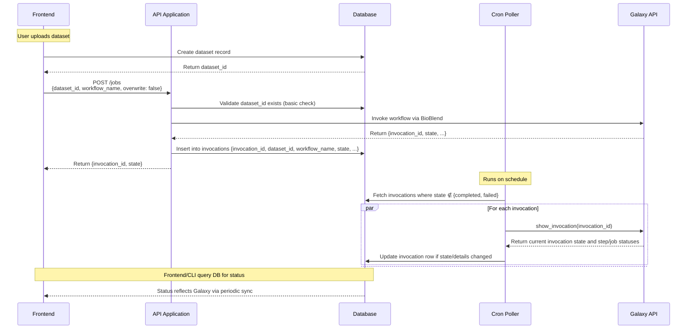

## 1. API Application Overview

The API application serves as a **unified orchestration layer** between the frontend/CLI and Galaxy (the job processing system), managing all database interactions and Galaxy communication.

**v1 Capabilities:**

- **Slim API spec**: `POST /jobs` immediately invokes a named Galaxy workflow for a given `dataset_id` via BioBlend and persists the returned `invocation_id` and initial state; `GET /jobs` lists invocations optionally filtered by `dataset_id`.
- **Workflow invocation (no orchestration DAG)**: The API directly invokes a single workflow on Galaxy per request. There is no internal pipeline/DAG engine in the API.
- **Lightweight request validation (no heavy Pydantic DAG checks)**: Basic checks only (e.g., `dataset_id` exists; optionally workflow name allowlist). Galaxy is the source of truth for invocation validity.
- **Cron-based status polling (no Celery)**: A cron job periodically queries Galaxy `show_invocation(invocation_id)` for all invocations that are not in a terminal state and updates their state in the database. Polling may run requests in parallel.
- **Database management**: Maintains an `invocations` table keyed by `invocation_id` with fields like `dataset_id`, `workflow_name`, `state` (e.g., queued, in_progress, completed, failed), timestamps, and optional per-step/job summaries from Galaxy responses. Frontend/CLI read from this table for status.
- **Rerun/override support**: Re-invocation of the workflow for a dataset is supported as a new invocation (optionally with overwrite flags if we choose to manage outputs at the storage layer).

**Future Extensions:**

- Upload URL generation (currently handled by separate cloud function)
- Download URL management
- CLI support for job management
- Enhanced job parameter customization

The core philosophy: **Database as single source of truth** with the API handling Galaxy invocation on write and a cron poller keeping invocation state in sync.

## 2. System Flow Diagram

## 3. Feature Breakdown

### **Feature 1: Request validation and immediate workflow invocation**

The API performs minimal validation on `POST /jobs` (e.g., ensuring `dataset_id` exists; optionally validating `workflow_name` against an allowlist) and immediately invokes the specified Galaxy workflow via BioBlend. The API returns the `invocation_id` and initial state from Galaxy.

### **Feature 2: Invocations table and state model**

An `workflow_invocations` table persists Galaxy `invocation_id`, `dataset_id`, `workflow_name`, `state` (e.g., queued, in_progress, completed, failed), timestamps, and optional step/job status summaries. This table is the single source of truth for client-facing status.

### **Feature 3: Cron poller for invocation status (parallel)**

A cron job periodically queries Galaxy `show_invocation(invocation_id)` for all invocations not in a terminal state. Queries may be executed in parallel. Any state or step/job status changes are written back to the `invocations` table.

### **Feature 4: Galaxy API integration layer**

`bioblend` provides a clean interface to Galaxy's API for workflow invocation and status inspection. Errors from Galaxy propagate as API errors on invocation; invalid workflows or parameters will be surfaced by Galaxy.

## 4. Endpoints (current minimal set)

- `POST /jobs`
  - Body: `{ dataset_id: string, workflow_name: string, overwrite?: boolean, parameters?: json / dict = {} }`
  - Behavior: Validate dataset exists → invoke workflow via BioBlend → persist `{invocation_id, state}` in `invocations` → return `{invocation_id, state}`.
- `GET /jobs`
  - Query: `dataset_id?: string`
  - Behavior: List invocations (optionally filtered by `dataset_id`) with current state and basic details.
