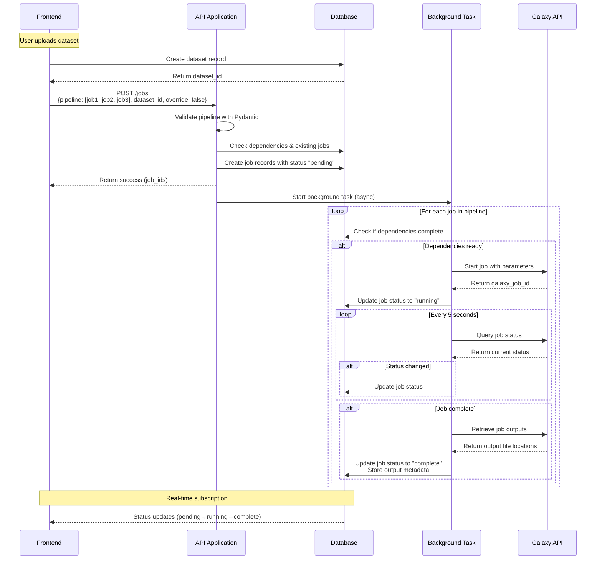

## 1. API Application Overview

The API application serves as a **unified orchestration layer** between the frontend/CLI and Galaxy (the job processing system), managing all database interactions and Galaxy communication.

**v1 Capabilities:**

- **Single endpoint**: `POST /jobs` - accepts pipeline definitions for data processing workflows
- **Job orchestration**: Manages complex job dependencies (standardization → segmentation → species ID) through database state
- **Pipeline validation**: Uses Pydantic models to validate job structures and dependencies
- **Background processing**: Async job execution with periodic Galaxy API polling (every 5 seconds)
- **Database management**: Updates job statuses in database based on Galaxy responses; frontend subscribes to database for real-time updates
- **Rerun/override support**: Ability to reprocess existing jobs with override flags

**Future Extensions:**

- Upload URL generation (currently handled by separate cloud function)
- Download URL management
- CLI support for job management
- Enhanced job parameter customization

The core philosophy: **Database as single source of truth** with the API handling all Galaxy communication through background tasks and database updates.

## 2. System Flow Diagram

## 3. Feature Breakdown

### **Feature 1: Pydantic Job Validation System**

This feature creates a comprehensive validation framework that handles all complex pipeline logic including job type validation, dependency chain verification (DAG structure), parameter validation, and database lookups for existing jobs. It serves as the "smart" component that ensures incoming pipelines are valid, properly ordered, and ready for execution before passing them to the processing engine.

### **Feature 2: Job Pipeline Processing Engine**

This component is intentionally "dumb" - it takes pre-validated pipeline structures from the validation system and simply executes them in order. It manages job queue mechanics in the database, tracks execution state, and handles the basic flow of moving jobs from pending to running status without making complex decisions about pipeline validity or dependencies.

### **Feature 3: Background Task Runner & Job Monitor**

This feature implements the async background processing system that monitors Galaxy jobs every 5 seconds and updates the database accordingly. It manages the lifecycle of jobs from submission through completion, handles parallel job execution, and ensures database consistency throughout the process.

### **Feature 4: Galaxy API Integration Layer**

This component provides a clean interface to Galaxy's API for job submission, status monitoring, and output retrieval. It abstracts away Galaxy-specific communication details, handles API errors gracefully, and manages the mapping between internal job representations and Galaxy's job format.
